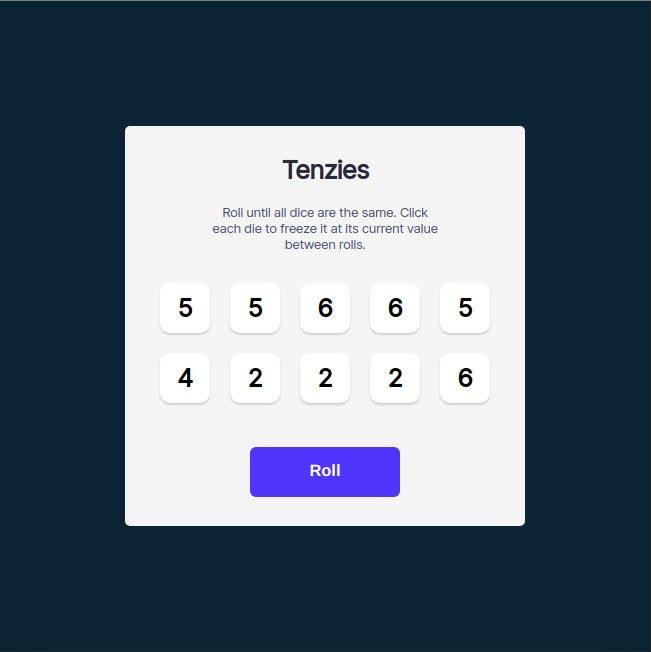
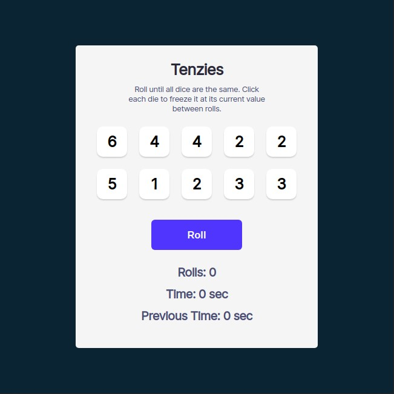
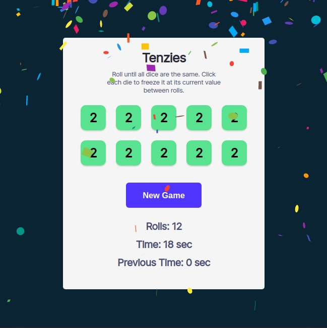
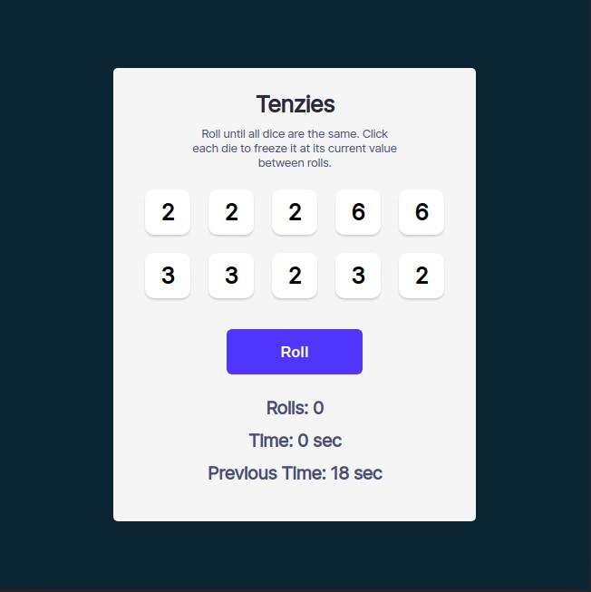

# Tenzies
Your first React game will be the popular dice game, Tenzies.

## Table of contents
- [Introduction](#introduction)
- [Overview](#overview)
  - [Screenshot](#screenshot)
  - [Built using](#built-using)
- [Added Features](#added-features)
- [Author](#author)
- [Acknowledgement](#acknowledgement)

## Introduction
- This is my solution to the fourth part of [Learn React](https://scrimba.com/learn/learnreact).
- This webpage was setup using [Vite](https://vitejs.dev/).
- This webpage features:
    - Interactive components
    - React Confetti
- With added features for extra credit:
    - Roll number tracker
    - Time tracker
    - Previous time display

## Overview
- Link: [github.com/kierhb/tenzies](https://github.com/kierhb/tenzies)

### Screenshot

### Built using

- HTML5 markup
- CSS
- Vanilla JavaScript
- ReactJS

## Added Features

- Tracking the number of rolls every time the roll button is clicked
- Tracking the time in seconds that starts whenever there's a change in the state of the dice
- Saving the previous time to the localStorage

## Author

- GitHub - [@kierhb](https://github.com/kierhb)
- LinkedIn - [Kier Bobila](https://www.linkedin.com/in/kier-bobila/)

## Acknowledgement
I want to acknowledge the course instructor Bob Ziroll and to all members of Scrimba community.
